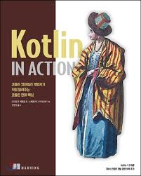

# Kotlin Study Repository
- 개인적으로 코틀린을 독학하면서 참고한 책이나 자료들을 읽고 공부한 것들을 정리한 저장소입니다.
- 제가 참고한 책이나 자료들은 README.md에 지속적으로 업데이트 할 예정입니다.

 
 

## Do It! Kotlin Programming - 황영덕 저
> 강의 : https://www.boostcourse.org/mo132/joinLectures/28611

- [Chap 01. 코틀린 시작하기](src/main/kotlin/doItKotlin/docs/Chap01.md)

- [Chap 02. 변수와 자료형, 연산자](src/main/kotlin/doItKotlin/docs/Chap02.md)

- [Chap 03. 함수와 함수형 프로그래밍](src/main/kotlin/doItKotlin/docs/Chap03.md)   
  [👩‍💻 관련 예제 코드 바로가기](src/main/kotlin/doItKotlin/chap03)

- [Chap 04. 프로그램의 흐름 제어](src/main/kotlin/doItKotlin/docs/Chap04.md)   
  [👩‍💻 관련 예제 코드 바로가기](src/main/kotlin/doItKotlin/chap04)

- [Chap 05. 클래스와 객체](src/main/kotlin/doItKotlin/docs/Chap05.md)   
  [👩‍💻 관련 예제 코드 바로가기](src/main/kotlin/doItKotlin/chap05)

- [Chap 06. 프로퍼티와 초기화](src/main/kotlin/doItKotlin/docs/Chap06.md)

 
 

## Kotlin In Action - 드미트리 제메로프, 스베트라나 이사코바 저 / 오현석 옮김   
   

- Chap 01. 코틀린이란 무엇이며, 왜 필요한가?   

 
- [Chap 02. 코틀린 기초](src/main/kotlin/kotlinInAction/docs/Chap02.md)   
  [👩‍💻 관련 예제 코드 바로가기](src/main/kotlin/kotlinInAction/chap02)

- [Chap 03. 함수 정의와 호출](src/main/kotlin/kotlinInAction/docs/Chap03.md)   
  [👩‍💻 관련 예제 코드 바로가기](src/main/kotlin/kotlinInAction/chap03)

- [Chap 04. 클래스, 객체, 인터페이스](src/main/kotlin/kotlinInAction/docs/Chap04.md)   
  [👩‍💻 관련 예제 코드 바로가기](src/main/kotlin/kotlinInAction/chap04)

- [Chap 05. 람다 프로그래밍](src/main/kotlin/kotlinInAction/docs/Chap05.md)   
  [👩‍💻 관련 예제 코드 바로가기](src/main/kotlin/kotlinInAction/chap05)

- [Chap 06. 코틀린 타입 시스템](src/main/kotlin/kotlinInAction/docs/Chap06.md)   
  [👩‍💻 관련 예제 코드 바로가기](src/main/kotlin/kotlinInAction/chap06)
