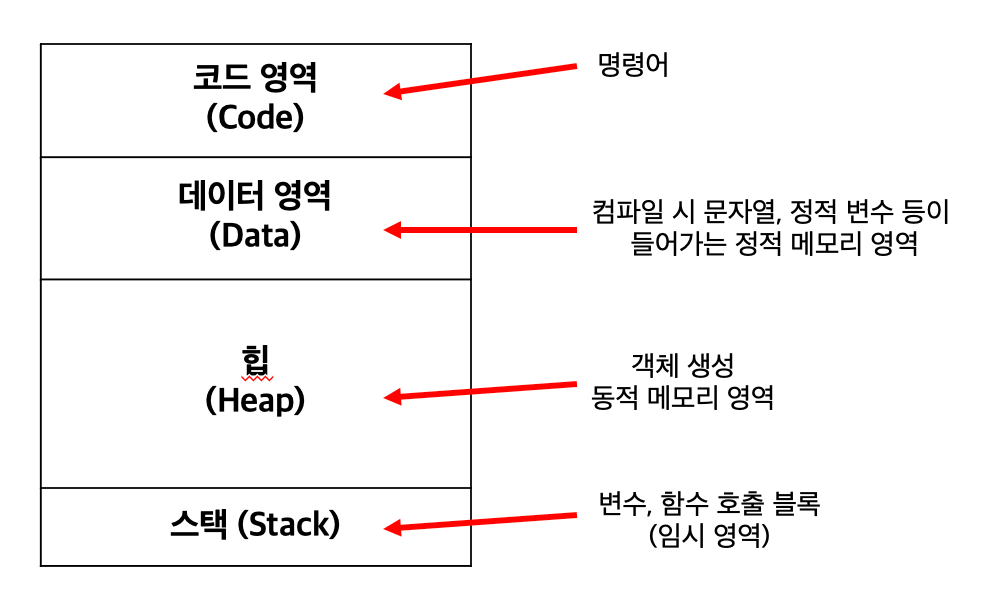

## Chapter 01. 코틀린 시작하기

1. 코틀린의 특징
    - JVM 기반 프로그래밍 언어
    - JS(JavaScript) 기반 Full-stack 웹 개발 가능
    - Android & IOS에서 모두 구동하는 애플리케이션 개발 가능
    

2. 코틀린의 장점
    - `높은 안정성` : 자료형 오류를 미리 잡을 수 있는 정적 언어
    - 널 포인터 예외로 인한 프로그램 중단 예방
    - 간결하고 효율적
    - 세미콜론 생략 가능
    -  `다중 패러다임 언어` :  함수형 프로그래밍 + 객체 지향 프로그래밍 모두 가능
       > **다중 패러다임 언어**란 ?
       > - 한 가지 구현 규칙에 얽매이지 않고 다양한 문법과 형식을 지원하는 언어를 말한다.
       > 

       
3. Kotlin이 안드로이드 공식 언어로 채택된 배경
   
    `Oracle이 자바 JDK에 대한 유료화 정책 시작 -> 구글에게 자바 JDK를 사용한 API에 대한 천문학적 금액의 특허 사용료 요구 -> 
   구글-오라클간의 법정 사용료 소송 진행 -> 자바 언어를 대체하기 위해 코틀린을 공식 언어로 채택 -> 자체 가상머신 제작 및 새 SDK 제작 진행`
   

4. Static Method
    - Method를 static으로 선언하면 프로그램의 정적 메모리 영역에 객체가 만들어지기 때문에 객체의 생성 없이 호출해 사용할 수 있게 된다.
    final은 최종 메서드임을 나타내고, void는 반환값이 없는 경우를 의미한다.
      

5. 프로그램의 메모리 영역
 

> GC (Garbage Collector) 란?
> - 동적 메모리 영역의 객체가 사용된 뒤 아무 참조가 없으면 자동으로 삭제하는 기능.
> 쓸모 없는 객체를 없애주는 쓰레기 청소부 역할 수행

6. 직접 main(arg: Array<String>)에 인자를 전달하고 싶은 경우
   - Intelij 기준 [Run > Edit Configurations] 에 Program arguments에 필요한 명령형 인자 나열하기.