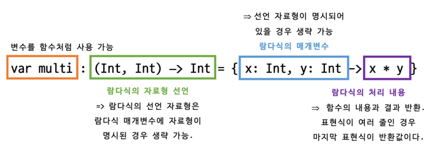

## Chapter 03. 함수와 함수형 프로그래밍

<br>

1. 함수 선언하고 호출하기
   1. 함수 선언하기
       ```kotlin
       fun 함수 이름([변수 이름: 자료형, 변수 이름: 자료형..]): [반환값의 자료형] {
            표현식...
            [return 반환값]
       }
       ```
       
        - 대괄호로 감싼 내용들은 생략 가능함.
        - 매개변수는 생략가능.  
   ###
   2. 함수 매개변수의 기본값 설정
    
       ```kotlin
        fun add (name: String, email: String = "default") {
            // 이 때, 매개변수 email로 넘어오는 value가 없으면 자동으로 default로 설정됨.
            val output = "${name}님의 이메일은 ${email}입니다."
            println(output)
        }
        ```
   ###
   3. 가변인자 Vararg(Variable Argument)
        - 가변인자란?
            - 인자의 개수가 변한다.
            - 똑같은 타입의 인자를 여러 개 받아야 하지만, 개수가 정해져 있지 않을 때 유용하다.
   ###
   
   > <h3>Stack OverFlow</h3>
   > - 함수의 프레임은 스택에 생성되고, 스택은 메모리의 높은 구조에서부터 낮은 구조로 생성된다. 힙 영역은 동적으로 생성된 객체의 정보가 담겨져 있는데, 
       보통 낮은 주소 -> 높은 주소로 주소값이 커져가면서 정보를 저장하기 때문에 **두 영역이 만나지 않도록 메모리를 관리하는 것이 중요**하다.
       만약 무한하게 함수를 호출하여 스택 프레임을 생성하면 정해진 스택 영역의 경계를 넘어서면서 힙 영역과 겹치게 되는데, 이 때 발생하는 오류를 **Stack Overflow** 라고 한다.

<br>

2. 함수형 프로그래밍
    1. 함수형 프로그래밍이란?
        - `순수 함수`를 작성하여 프로그램의 부작용을 줄이는 프로그래밍
        - `람다식`과 `고차함수` 사용
    ###
    2. 함수형 프로그래밍의 정의와 특징
        - 순수 함수를 사용해야 한다.
        - 람다식을 사용할 수 있다.
        - 고차 함수를 사용할 수 있다.
    ###
    3. 순수 함수
        - 부작용이 없는 함수. 함수 외부의 어떤 상태도 바꾸지 않음.
        - 스레드에 사용해도 안전하고 코드를 테스트하기도 쉽다.
        - 값이 예측가능하므로 결정적이라고도 한다.
    ###
    4. 순수함수의 조건
        - 같은 인자에 대하여 항상 같은 값을 반환한다.
        - 함수 외부의 어떤 상태도 바꾸지 않는다.
    ###
    5. 람다식(Lambda Expressions)
        - 이름이 없는 함수 형태, 람다 대수에서 유래됨.  
        
            ex) `{x, y -> x + y}`
    ###
    6. 일급 객체의 특징
        - 일급 객체는 함수의 인자로 전달할 수 있다.
        - 일급 객체는 함수의 반환값에 사용할 수 있다.
        - 일급 객체는 변수에 담을 수 있다.   
        
        => **함수형 프로그래밍에서는 함수를 일급 객체로 생각한다. 즉, 함수의 인자나 반환값 변수에 또 다른 함수를 사용할 수 있다는 의미다.**
    
<br>

3. 고차 함수와 람다식
    1. 고차 함수(High-order Function)란?
        - 다른 함수를 인자로 사용하거나 함수를 결괏값으로 반환하는 함수.
        ####
        ```kotlin
        fun main() {
            println(highFunc({x, y -> x + y}, 10, 20))
        }
       
        fun highFunc(sum: (Int, Int) -> Int, a: Int, b: Int) : Int = sum(a, b)
       
        // 위의 함수를 풀어서 쓰면
        fun highFunc(sum: (Int, Int) -> Int, a: Int, b: Int): Int {
            // 이 함수는 람다식의 표현문에 따라 결국 a + b의 정수값을 반환함.
            return sum(a, b)
        }
       
        ```
    ###  
   
    2. 람다식의 선언과 할당   
        ####  
        
       
    ###   
   
    3. 람다식과 고차함수 호출하기
        - 기본형 변수로 할당된 값 -> stack(스택)에 저장됨.    
          => 기본형 변수로 할당된 값이 다른 함수에 인자로 전달되는 경우에는 **해당 값**이 복사되어 전달됨.
          
        - 참조형 변수로 할당된 객체 -> 객체는 Heap(힙)에 저장되고, 참조 주소가 stack(스택)에 저장됨.    
          => 참조형 변수로 할당된 객체가 다른 함수의 인자로 전달되는 경우 **참조 주소**가 복사되어 전달됨.
          
        ### Call By Value (값에 의한 호출)
            * 함수가 또 다른 함수의 인자로 전달될 경우 람다식 함수는 값으로 처리되어 그 즉시 함수가 수행된 후 값을 전달함.
    
        ### Call By Name (이름에 의한 호출)
            * 함수의 이름이 또 다른 함수의 인자로 전달될 경우 사용되기 전까지는 람다식이 실행되지 않음.
            * 상황에 맞춰 즉시 실행할 필요가 없는 코드를 작성하는 경우 이름에 의한 호출 방법을 통해 필요할 때만 람다식이 작동하도록 만들 수 있음.
    
        - 다른 함수의 참조에 의한 일반 함수 호출하기
            - 인자 수와 자료형의 개수가 동일할 때 2개의 콜론 기호(::)를 함수 앞에 사용해 소괄호와 인자를 생략하고 함수를 호출할 수 있음.
              
                ```kotlin
                fun main() {
                   // 다음 세 문장이 동일한 결과를 출력함.
                   hello(::text) // 함수 참조 기호 사용.
                   hello({a, b -> text(a, b)})  // 람다식 표현.
                   hello{a, b -> text(a, b)}    // 소괄호 생략 가능.
                }
              
                fun text(a: String, b: String) = "Hi! $a $b"
                
                fun hello(body: (String, String) -> String): Unit {
                    println(body("Hello", "World"))
                }
                 ```  
<br>

4. 고차 함수와 람다식의 사례 알아보기
    1. 코틀린 Call Back 함수 구현
      ####
      > ### 콜백 함수(Call back) 란?
      > 특정 이벤트가 발생하기까지 처리되지 않다가 이벤트가 발생하면 즉시 호출되어 처리되는 함수를 말한다.
      > 즉, 사용자가 아닌 시스템이나 이벤트에 따라 호출 시점을 결정한다.
      >
   
    ###
   
    2. 콜백함수를 코틀린으로 구현하기 (vs Java)
        - 인터페이스나 익명 객체 불필요
        - 함수에서 바로 람다식의 형태로 네트워크 성공/실패에 대한 코드가 구현 가능함.
    
    ###
   
    3. 코틀린에서의 네트워크 호출 구현
       - 자바로 만들어진 네트워크 호출 구현 예시

         ```java
         public interface Callback {
            void onSuccess(ResultType result);
            void onError(Exception exception);
         }
         
         // networkCall 호출
         public void networkCall(Callback callback) {
            try {
                ...
                // 성공하면 onSuccess() 콜백 함수 호출
                callback.onSuccess(myResult);
            catch (Throwable e) {
                // 실패하면 onError() 콜백 함수 호출
                callback.onError(e);
            }
         }

         networkCall(new Callback()) {
            public void onSuccess(ResultType result) {
                // 네트워크 호출에 성공했을 때의 구현부
                ...
            }

            public void onError(Exception e) {
                 // 네트워크 호출에 실패했을 때의 구현부  
                 ...
            }
         }
            ```
       ###
       - 코틀린으로 만들어진 네트워크 호출 구현 예시
            ```kotlin
            // 1. 람다식 함수의 매개변수를 가진 networkCall() 함수 선언 
            fun networkCall(onSuccess: (ResultType) -> Unit, onError: (Throwable) -> Unit) {
                try { 
                    ...
                    // 성공
                    onSuccess(myResult)
                } catch (Throwable e) {
                    // 실패
                    onError(e)
                }
            }
                
            // 2. networkall() 함수 사용 - 인자 형식에 람다식을 사용 
            networkCall(result -> {
                // 네트워크 호출에 성공했을 때 구현부 
            }, error -> {
                // 네트워크 호출에 실패했을 때 구현부 
            }) 
            ```

<br>

5. 코틀린의 다양한 함수 알아보기
    1. 익명 함수 (Anonymous Function)
       - 일반 함수이지만 이름이 없는 것.
       - 람다식에서는 return이나 break, continue와 같은 제어문을 사용하기 어렵기 때문에 조건식에 따라 함수를 중단하고 반환해야 하는 경우에 익명함수를 사용함.

         ```kotlin
         val add: (Int, Int) -> Int = fun(x, y) = x + y
         val add = fun(x: Int, y: Int) = x + y
         val add = {x: Int, y: Int -> x + y}
         ```
    
    ###
    
    2. 인라인 함수(Inline Function)
       - 함수가 호출되는 곳에 함수 본문의 내용을 모두 복사해 넣어 함수의 분기 없이 처리되기 때문에   
         
         분기 복구 작업으로 인한 프로세스와 메모리 사용을 줄여 코드의 성능을 높일 수 있다.

    ###
       
    3. 확장 함수(Extension Function)
        - 클래스처럼 필요로 하는 대상에 함수를 더 추가할 수 있는 개념.
        - 기존 클래스의 선언 구현부를 수정하지 않고 외부에서 손쉽게 기능을 확장할 수 있다는 장점이 있다.
        - 특히 기존 라이브러리를 수정하지 않고도 확장할 수 있기 때문에 유용하다.
        - 이 때, 확장하려는 대상에 동일한 이름의 멤버 함수 혹은 메서드가 존재한다면 확장 함수보다 멤버 메서드가 우선적으로 호출된다.

    ###
